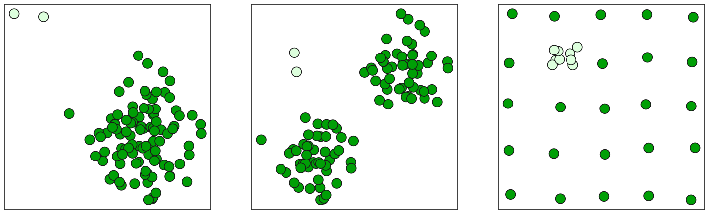

# Anomaly Detection Visualization

**Ready-to-use Jupyter notebooks** for generating presentation-quality plots demonstrating anomaly detection methods (kNN, Isolation Forest, PCA, HBOS).  
Used in the *Positive Hack Days* conference talk. Fork and run to reproduce slides or adapt for your needs.



## Features

- **Plug & Play**: Pre-configured notebooks with example datasets.
- **Conference-Ready**: Clean, styled visuals (Seaborn/Matplotlib).
- **Algorithms Covered**:
  - k-Nearest Neighbors (kNN)
  - Isolation Forest
  - Principal Component Analysis (PCA)
  - Histogram-Based Outlier Detection (HBOS)

## Quick Start
1. Clone the repo:

   ```bash
   git clone https://github.com/onixlas/phd-2025-anomaly-detection.git
   ```

2. Install dependencies:

   ```bash
    pip install -r requirements.txt
   ```

3. Run any notebook.

## Tech Stack

* Python + Jupyter Notebook
* Libraries: Scikit-learn, Pandas, NumPy, PyOD, Seaborn
